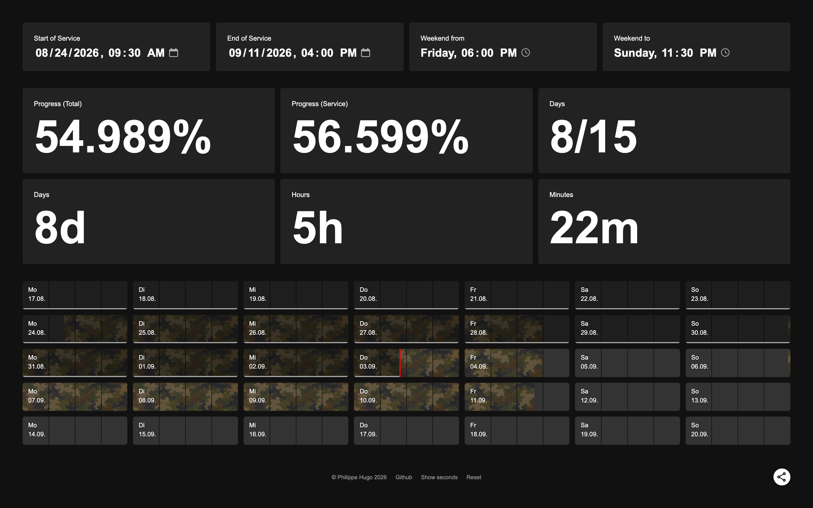

# Is it over yet?

Tired of your military or civil service? Track the progress of your recurit training/school or repetition course with this simple tool.

Either use [isitoveryet.ch](https://isitoveryet.kolleeeg.ch) directly or spin up your own server and self host the tool there.

## Features

- Selecting start and end date of your service
- Configure beginning and end of weekends
- Dashboard-like overview of your current progress
- Check your progress at different points in time by hovering the timeline
- Share your progress as an image by clicking the share button

## Contribution

Feel free to open an issue or PR for new features or bugs.